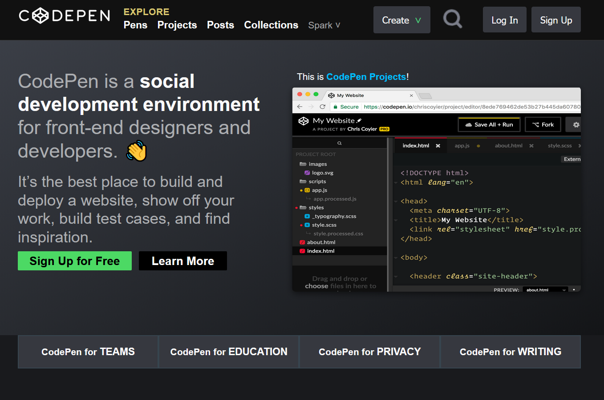

# CS100

## Project Overview

This repository is dedicated to the **Course CS100** and contains the related course materials. Based on the file structure and programming languages used, this project functions as a **web page**.

The primary languages in this repository are:
*   **CSS** 
*   **HTML**

## Project Structure (Web Page Dependencies)

The core web page is represented by the `Index.html` file. It relies on two main dependent folders for its functionality and presentation:

1.  **`Styles` folder:** This folder holds the stylesheets (CSS files) necessary for formatting and designing the web page. This aligns with the high percentage of CSS code found in the repository [2].
2.  **`Images` folder:** This folder is designated to store the visual assets, such as screenshots or graphics, used by the web page.

### Repository Contents

The main identified files and folders are:
*   `Index.html` (The primary web page)
*   `Styles` (Contains styling information)
*   `Images` (Contains visual assets)
*   `README.md`

## Project Sample

Below is a sample image, `Captura.png`, located within the `Images` folder:

